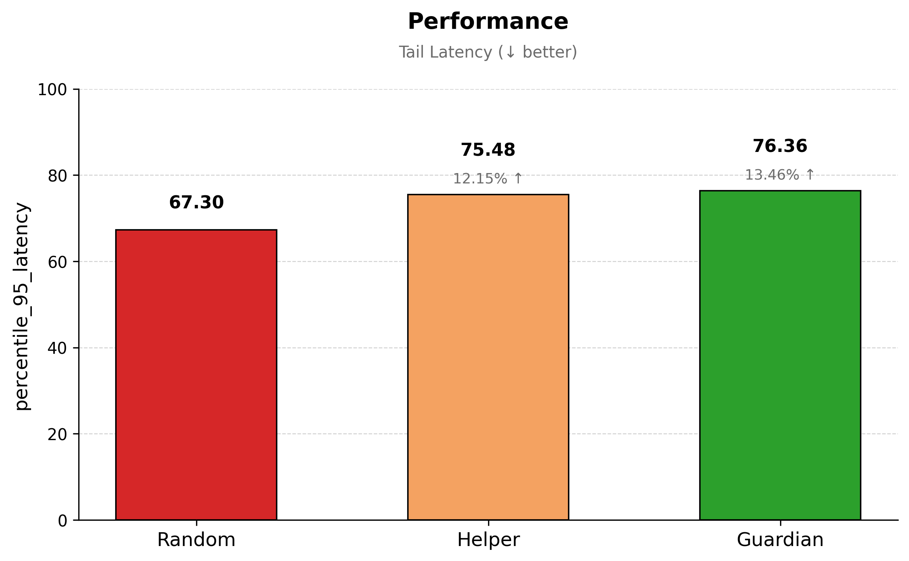
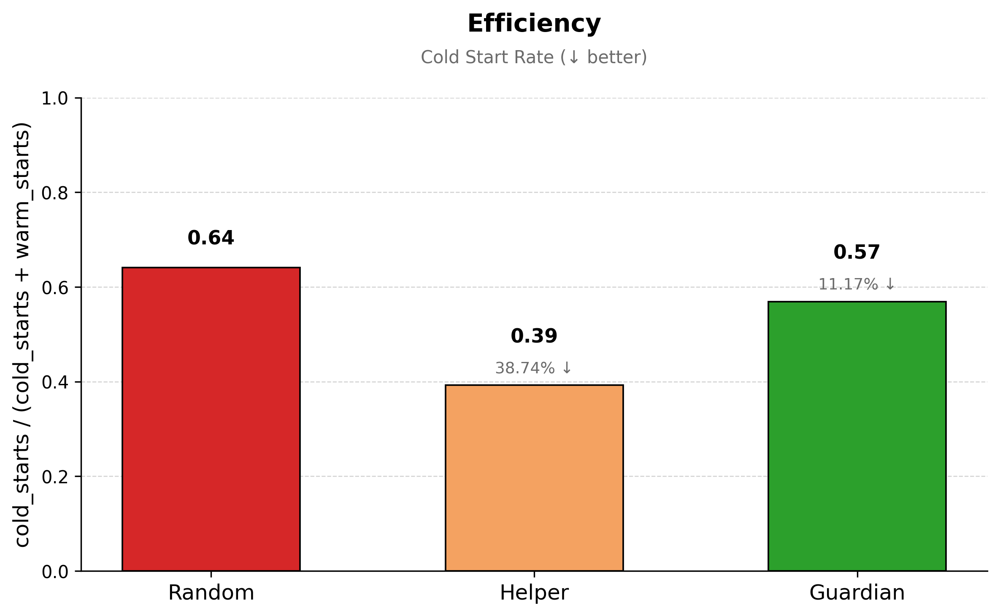
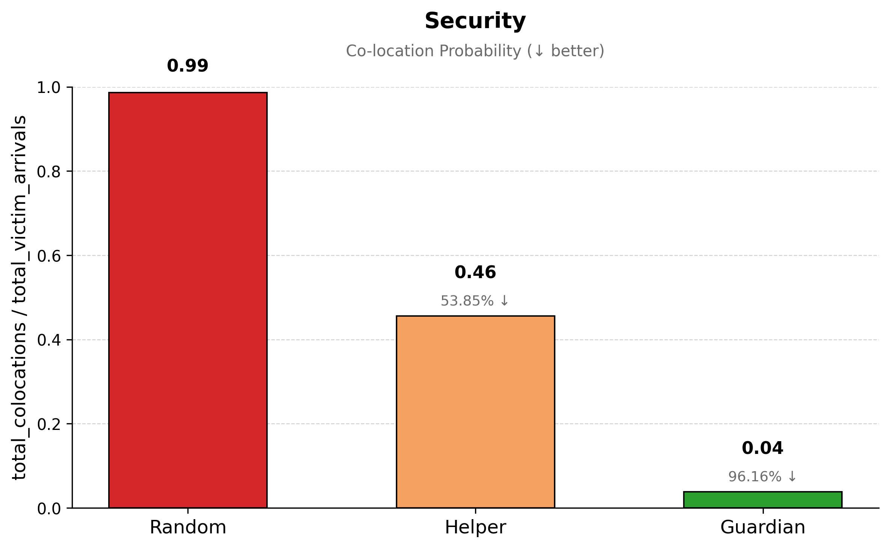

# Megha: Serverless Security Simulator

**CS6630: Secure Processor Microarchitecture**
Anirudh T E · CS25S005 · Jan-May 2026 · IIT Madras

## Table of Contents

1. [Introduction](#1-introduction)
2. [Background](#2-background)
   2.1 [Serverless Platforms](#21-serverless-platforms)
   2.2 [Cache-Aware Scheduling](#22-cache-aware-scheduling)
3. [Architecture](#3-architecture)
   3.1 [Simulation Engine](#31-simulation-engine)
   3.2 [Platform State](#32-platform-state)
   3.3 [Pluggable Schedulers](#33-pluggable-schedulers)
4. [Schedulers](#4-schedulers)
   4.1 [Random Scheduler](#41-random-scheduler)
   4.2 [Helper Scheduler](#42-helper-scheduler)
   4.3 [Guardian Scheduler](#43-guardian-scheduler)
5. [Methodology](#5-methodology)
   5.1 [Experiment Design](#51-experiment-design)
   5.2 [Evaluation Criteria](#52-evaluation-criteria)
6. [Results](#6-results)
   6.1 [Performance](#61-performance)
   6.2 [Efficiency](#62-efficiency)
   6.3 [Security](#63-security)
7. [Analysis](#7-analysis)
   7.1 [Summary](#71-summary)
   7.2 [Tradeoffs](#72-tradeoffs)
   7.3 [Future Scope](#73-future-scope)
8. [Conclusion](#8-conclusion)
9. [References](#9-references)

---

## 1. Introduction

Serverless computing, or Functions-as-a-Service (FaaS), abstracts cluster management responsibilities while obscuring scheduling, container reuse, and resource allocation mechanisms. These underlying decisions significantly impact both system performance and security. Prior research, including studies utilizing the Kumo simulator, demonstrates that scheduling policies independently cause orders-of-magnitude variations in attacker-victim co-location probabilities. This variance exists independently of software vulnerabilities within the tenant code.

Microarchitectural attacks, such as cache timing channels, generally require hardware co-residency. Kumo models co-location at the system level by evaluating whether attacker and victim tenants occupy the same worker during invocation placement. It intentionally omits cycle-accurate cache hierarchies and probe success rates. Megha investigates a complementary hypothesis: lightweight telemetry approximating cache pressure can enable a scheduler to further reduce co-location risks without introducing unacceptable latency overheads.

**Contributions:**

| Component                                                       | Origin             |
| :-------------------------------------------------------------- | :----------------- |
| Simulation Engine (`Engine`, `Event`)                           | Adapted from Kumo  |
| Platform Model (`WorkerView`, `Container`, `FunctionProfile`)   | Adapted from Kumo  |
| Baseline Schedulers (`RandomScheduler`, `HelperScheduler`)      | Adapted from Kumo  |
| Cache-Aware Scheduler (`MicroarchProfile`, `GuardianScheduler`) | Developed in Megha |

---

## 2. Background

### 2.1 Serverless Platforms

A serverless platform comprises a pool of shared workers that execute tenant functions on demand via lightweight containers. Upon receiving a function invocation, the platform executes a scheduling decision to assign a worker, initializes or reuses a container, allocates necessary resources, and processes the request. If an idle container for the requested function exists, the invocation utilizes it, resulting in a **warm start**. Otherwise, a new container is initialized, causing a **cold start**. These placement and reuse decisions directly dictate latency, resource utilization efficiency, and tenant isolation.

Because multiple tenants share the same worker infrastructure, serverless platforms are susceptible to **co-location attacks**. Adversaries repeatedly execute controlled functions to maximize the probability of being scheduled on the same worker as a targeted victim tenant. Successful co-location facilitates microarchitectural side-channel attacks that exploit shared hardware resources, particularly the last-level cache (LLC). While attackers lack direct visibility into placement decisions, concurrent residency on shared hardware remains a fundamental prerequisite for these exploits.

### 2.2 Cache-Aware Scheduling

Existing policies, such as **Random** and **Helper**, optimize for placement diversity, data locality, or tenant distribution, rather than mitigating cache contention. Consequently, a cache-intensive attacker can achieve co-location with victim workloads even when the scheduler actively optimizes for reuse or system-level isolation.

Megha evaluates whether lightweight LLC miss-rate telemetry can address this vulnerability when integrated into a tractable event-driven simulation model. The proposed **Guardian** scheduler classifies invocations as _thrash-hot_ or _thrash-cool_. It consolidates hot traffic onto heavily utilized workers while preferentially routing cool victim workloads to untainted workers. The primary hypothesis is that this cache-aware placement strategy substantially reduces attacker-victim co-location probabilities relative to baseline schedulers, while maintaining acceptable cold-start and tail-latency overheads.

---

## 3. Architecture

### 3.1 Simulation Engine

The simulator advances logical time utilizing a min-heap of timestamped events, operating without a fixed time step. Workload entries enqueue invocations at their respective arrival times. The execution engine extracts the earliest event, updates the logical clock, and executes the associated handler.

The execution path is modeled through four primary event types:

1. **Invocation Start:** Upon arrival, the scheduler selects a target worker. The engine determines whether a warm or cold start is required based on idle container availability and schedules execution following the corresponding startup delay. Placement occurs entirely within this initial event.
2. **Invocation Execute:** At the deferred execution time, the engine evaluates worker capacity. If the worker is fully utilized, the request is enqueued in a bounded per-worker FIFO queue, where overflows are recorded as dropped requests. Otherwise, the engine claims a container, allocates CPU, memory, and storage resources, and schedules a completion event based on the service duration.
3. **Invocation Complete:** Allocated resources are released, the container transitions to an idle state, and telemetry metrics are recorded. If the function configuration specifies an idle timeout, a cooldown event is scheduled.
4. **Container Cooldown:** Following the idle timeout period without reuse, the container is destroyed. Subsequent invocations for that function on the same worker will require a cold start.

Following each completion event, the engine processes the next queued invocation for that specific worker. The engine strictly manages logical time, queues, containers, and metrics, ensuring that the scheduling policy remains modular.

### 3.2 Platform State

The simulation cleanly separates static configuration, such as the function catalog, from mutable state, which includes workers and containers. Schedulers access a read-only snapshot of this state, while only the engine modifies placement states during event execution.

**Function Catalog:** Each defined function retains tenant identity, CPU, memory, and storage requirements, deployment metadata, cold and warm startup delays, idle timeout configurations, and a synthetic LLC miss-rate profile utilized by cache-aware policies.

**Workload Entries:** Workload traces are parsed into lightweight invocation objects containing identifiers, function and tenant mappings, arrival times, service durations, and optional labels. Resource and timing constraints are dynamically resolved from the function profile during scheduling.

**Workers and Containers:** Individual workers monitor utilized capacity, co-located tenant identities, active containers, and functions possessing warm idle instances. A container represents a single function instance on a specific worker. Containers track their operational state, the timestamp of their last utilization, and optional lifetime execution counts.

**Hosting Constraints:** Schedulers and the simulation engine utilize identical capacity validation rules. The available CPU, memory, and storage must accommodate the function's documented requirements. This validation occurs during both placement and execution to accurately reflect real-time contention.

### 3.3 Pluggable Schedulers

The scheduling architecture is fully pluggable. Each policy implements a standard interface, reads the platform state snapshot at invocation time, and returns either a selected worker identifier or a failure code. Policies may maintain private internal states, such as counters or taint sets, but do not directly mutate engine-owned components.

- **Random:** A stateless policy that uniformly distributes placements among workers with available capacity. This serves as the baseline for evaluating systems lacking reuse or isolation mechanisms.
- **Helper:** A sticky placement policy that tracks per-function invocation frequencies per worker. It prioritizes warm reuse and scales out to alternate workers only when a host exceeds a defined threshold.
- **Guardian:** A cache-aware policy utilizing per-function LLC miss profiles. It categorizes invocations as hot or cool, tracks worker thrash levels, and selectively routes traffic to mitigate co-location risks.

---

## 4. Schedulers

### 4.1 Random Scheduler

The Random scheduler operates statelessly. It retains no historical data regarding prior placements, tenant identities, warm container availability, or cache behavior. Each incoming invocation is assigned uniformly at random to any worker possessing sufficient spare capacity.

```pseudocode
function ScheduleRandom(invocation, state):
    candidates = { w ∈ state.workers | w.can_host(invocation.func) }

    if candidates == ∅:
        return FAIL

    w = uniform_random(candidates)
    return w
```

### 4.2 Helper Scheduler

The Helper scheduler implements a sticky placement strategy designed to maximize container reuse and minimize cold starts. It operates without analyzing tenant identities or cache pressure metrics.

The policy tracks the recent execution frequency of each function across all available workers. As long as the execution count on a specific worker remains below a predefined threshold, subsequent invocations of that function are preferentially routed to that host. Once the threshold is exceeded, placement scales out to other eligible workers. Execution counts on inactive hosts decay over time, ensuring that stale workers are eventually phased out of the active placement map.

```pseudocode
function ScheduleHelper(invocation, state, T):
    func = invocation.func
    candidates = { w ∈ state.workers | w.can_host(func) }

    if candidates == ∅:
        return FAIL

    freq = state.inv_freq[func]

    if freq.is_empty():
        w = uniform_random(candidates)
        freq[w] = 1
        decay_other_workers(freq, w)
        return w

    existing_hosts = candidates ∩ freq.keys()

    if existing_hosts ≠ ∅:
        w = uniform_random(existing_hosts)
        if freq[w] < T:
            freq[w] = freq[w] + 1
            decay_other_workers(freq, w)
            return w

    new_hosts = candidates \ freq.keys()
    fallback_pool = new_hosts if new_hosts ≠ ∅ else candidates
    w = uniform_random(fallback_pool)

    if w ∉ freq.keys():
        freq[w] = 1
    else if freq[w] < T:
        freq[w] = freq[w] + 1

    decay_other_workers(freq, w)
    return w
```

### 4.3 Guardian Scheduler

The Guardian scheduler integrates cache-awareness into the placement logic. It utilizes the LLC miss rates associated with each function to classify invocations as either thrash-hot or thrash-cool. Furthermore, it calculates a smoothed thrash score for each worker based on currently executing containers, achieving this without requiring cycle-accurate cache simulation.

Workers assigned a hot invocation are subsequently marked as tainted. Future hot invocations are preferentially routed to the tainted worker exhibiting the highest thrash score. If no tainted workers possess available capacity, the invocation is routed to the untainted worker with the lowest thrash score, which then becomes tainted. Conversely, cool invocations are placed uniformly at random across untainted eligible workers. If all available workers are tainted, cool invocations are placed on any worker with sufficient capacity.

```pseudocode
function UpdateThrashMetrics(now, state):
    for w in state.workers:
        dt = now - w.last_sample
        if dt <= 0:
            continue

        d_cycles = dt * 10^9

        for c in w.busy_containers:
            w.cumulative_cycles += d_cycles
            miss_rate = c.func.r_load + c.func.r_store
            w.cumulative_misses += d_cycles * miss_rate

        w.last_sample = now
        delta_cycles = w.cumulative_cycles - w.prev_cycles

        if delta_cycles > 0:
            delta_misses = w.cumulative_misses - w.prev_misses
            raw_thrash = delta_misses / delta_cycles
            w.C_thrash = (0.2 * raw_thrash) + (0.8 * w.C_thrash)
            w.prev_cycles = w.cumulative_cycles
            w.prev_misses = w.cumulative_misses


function ScheduleGuardian(invocation, state):
    UpdateThrashMetrics(invocation.arrival_time, state)

    func = invocation.func
    candidates = { w ∈ state.workers | w.can_host(func) }

    if candidates == ∅:
        return FAIL

    is_hot = (func.r_load + func.r_store) > 0.01

    if is_hot:
        tainted_candidates = candidates ∩ state.tainted_workers

        if tainted_candidates ≠ ∅:
            w = argmax(w.C_thrash for w in tainted_candidates)
        else:
            w = argmin(w.C_thrash for w in candidates)

        state.tainted_workers = state.tainted_workers ∪ { w }
    else:
        cool_candidates = candidates \ state.tainted_workers
        pool = cool_candidates if cool_candidates ≠ ∅ else candidates
        w = uniform_random(pool)

    return w
```

---

## 5. Methodology

### 5.1 Experiment Design

The evaluation methodology involves a comparative analysis of the Random, Helper, and Guardian schedulers. The simulation environment models a multi-tenant serverless cluster consisting of 32 workers and 64 tenants. The experimental workload is generated using a Poisson arrival process infused with a synthetic co-location attacker designed to maximize cache contention. To ensure statistical robustness, the simulation is executed across twenty distinct random seeds for each scheduling policy.

### 5.2 Evaluation Criteria

The schedulers are evaluated against three primary metrics, reflecting performance, efficiency, and security:

1.  **Tail Latency:** Measured as the 95th-percentile end-to-end latency experienced by tenant invocations.
2.  **Cold-start Rate:** Defined as the fraction of total invocations that fail to find a warm container and subsequently incur initialization delays.
3.  **Co-location Probability:** Calculated as the probability that a victim tenant invocation is scheduled on the same worker as an attacker tenant at the time of placement.

---

## 6. Results

### 6.1 Performance



Performance is evaluated using the mean 95th-percentile end-to-end latency across all twenty random seeds. The Random scheduler achieves the lowest mean tail latency at 67.30 (± 0.40). Aggressive reuse and placement concentration inherently increase queuing delays. Consequently, the Helper and Guardian schedulers exhibit higher tail latencies of 75.48 (± 1.09) and 76.36 (± 2.48), respectively, representing an approximate 13 to 14 percent overhead compared to the baseline. Guardian exhibits slightly higher variance across seeds, indicating that taint-driven workload spreading interacts dynamically with stochastic arrival patterns. Rapid saturation of untainted workers forces subsequent invocations into queues, increasing latency for specific random seeds.

### 6.2 Efficiency



System efficiency is quantified by the cold-start rate. The Helper scheduler achieves the lowest mean cold-start rate at 0.392 (± 0.011), as its sticky placement logic explicitly optimizes for container reuse. Conversely, the Random scheduler yields a significantly higher rate of 0.640 (± 0.002) due to the absence of reuse bias. The Guardian scheduler produces an intermediate cold-start rate of 0.569 (± 0.007). By spreading cool victim workloads across multiple untainted workers, Guardian sacrifices some warm reuse opportunities compared to Helper, but still improves upon the completely stateless Random baseline.

### 6.3 Security



Security is measured by the attacker-victim co-location probability. The Random scheduler results in near-certain co-location, exhibiting a probability of 0.987 (± 0.002) due to uniform distribution among competing tenants. The Helper scheduler reduces this probability to 0.455 (± 0.029) through the secondary effects of data locality, yet still exposes victims frequently. The Guardian scheduler achieves the most significant security improvement, reducing the mean co-location probability to 0.038 (± 0.027). Under Guardian, hot attacker traffic is isolated on high-thrash tainted workers, while cool victim traffic is routed to the remaining untainted pool.

---

## 7. Analysis

### 7.1 Summary

The experimental results demonstrate that cache-aware scheduling materially reduces co-location probabilities. Guardian isolates cache-intensive attacker traffic effectively, preventing it from mixing with typical victim workloads. While the Helper scheduler improves system efficiency by minimizing cold starts, its lack of cache awareness prevents it from achieving the isolation levels provided by Guardian. Therefore, scheduler design acts as a primary mechanism for enforcing microarchitectural isolation in serverless environments, even when utilizing abstracted telemetry models.

### 7.2 Tradeoffs

The findings highlight a fundamental tension between security, performance, and efficiency. No single scheduling policy simultaneously optimizes tail latency, cold-start rates, and isolation. The Guardian scheduler explicitly shifts the Pareto frontier toward security. It achieves a 96 percent reduction in co-location probability relative to the Random scheduler, but this isolation incurs a cost in both tail latency and container reuse efficiency. For security-sensitive deployments, these performance degradation metrics may be deemed acceptable when strict isolation guarantees are required.

### 7.3 Future Scope

The current implementation utilizes an abstract cache model with static LLC miss rates and monotonic worker tainting. Future iterations of this architecture should incorporate dynamic taint decay mechanisms, allowing workers to return to the untainted pool when thrash levels subside or the worker becomes idle. Additionally, integrating online profiling derived from hardware performance monitoring counters (PMCs) would replace synthetic profiles with empirical telemetry. Expanding the evaluation to include time-weighted co-location metrics will also provide a more comprehensive assessment of sustained microarchitectural exposure.

---

## 8. Conclusion

Megha extends the discrete-event serverless simulator, Kumo, by introducing an abstract LLC pressure model and implementing the Guardian cache-aware scheduler. By classifying invocations based on anticipated cache intensity and directing traffic through a taint-based placement algorithm, Guardian effectively segregates attacker workloads from typical tenant traffic. The evaluation confirms that cache-aware scheduling dramatically reduces attacker-victim co-location probabilities compared to standard Random and locality-optimizing Helper policies. While this isolation introduces measurable increases in tail latency and cold starts, it validates the hypothesis that lightweight telemetry can be leveraged at the scheduler level to mitigate microarchitectural side-channel risks in multi-tenant serverless platforms.

---

## 9. References

1. W. Shao, K. N. Khasawneh, S. Rafatirad, H. Homayoun, and C. Fang, "Kumo: A Security-Focused Serverless Cloud Simulator," 2026.

2. W. Shao et al., "Bit of a Close Talker: A Practical Guide to Serverless Cloud Co-Location Attacks," 2025.

3. Z. N. Zhao, A. Morrison, C. W. Fletcher, and J. Torrellas, "Everywhere All at Once: Co-location Attacks on Public Cloud FaaS," 2024.

4. E. Marin, D. Perino, and R. Di Pietro, "Serverless Computing: A Security Perspective," Journal of Cloud Computing, vol. 11, no. 1, 2022.

5. Kumo artifact repository. (https://github.com/weishao-sec/kumo)
